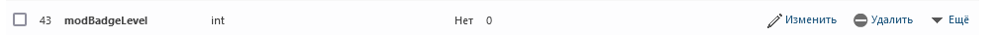

# BadgeCustomizer

__Что это такое?__

<p>BadgeCustomizer - мод для кастомизации значков ролей. </p>
<em>работает только на гдпсах</em>

__Как настраивать?__

- создаём файл **badgeCustomizer.json** в ресурсах гд
- закидываем png файлы беджиков
- настраиваем json файл
- настраиваем modBadgeLevel в бд <em>(на ядре GMDPrivateServer, на кастомном ядре описано в конце доков)</em>
пример:
```json
{
  	"1": "badge1.png",
	"2": "badge2.png",
	"3": "badge3.png",
	"4": "badge4.png"
}
```



- Насчёт кастомного ядра.

Как мы знаем, в requestUserAcces.php робтоп запрашивает только айди бейджа (в гд это айди роли):
```php
<?php
// Cvolton - GMDPrivateServer

chdir(dirname(__FILE__));
//error_reporting(0);
require_once "../lib/GJPCheck.php";
require_once "../lib/exploitPatch.php";
require_once "../lib/mainLib.php"; //this is connection.php too
$gs = new mainLib();

$accountID = GJPCheck::getAccountIDOrDie();

if ($gs->getMaxValuePermission($accountID,"actionRequestMod") >= 1) { // checks if they have mod
	$permState = $gs->getMaxValuePermission($accountID,"modBadgeLevel"); // checks mod badge level so it knows what to show					   
	if ($permState >= 2){ // if the mod badge level is higher than 2, it will still show elder mod message
		exit("2");
	}
	echo $permState; // Вот тут оно выдаёт айди, modBadgeLevel
}
?>
```
т.е. оснавная задача сделать так, чтобы эоот файл возвращал именно айди нужного беджа, который вы указали в json файле конфига мода
